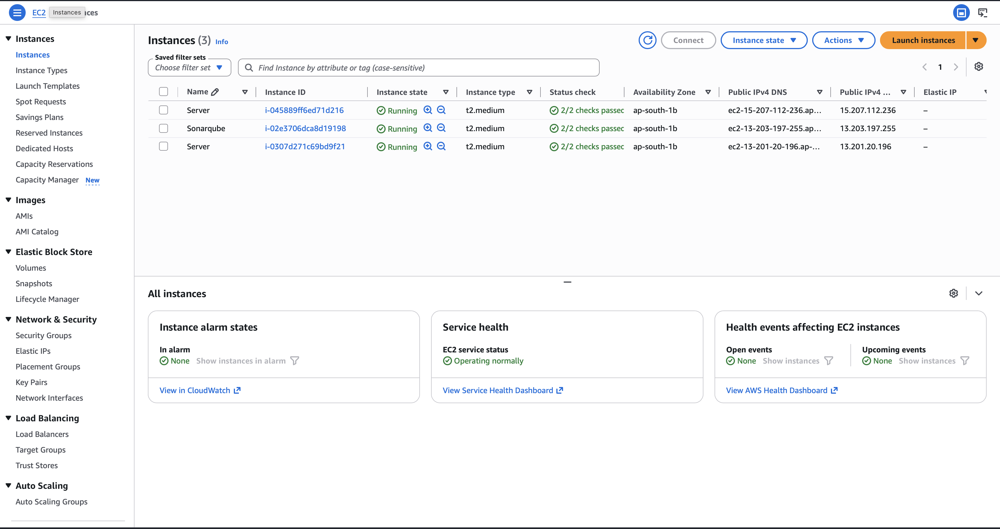
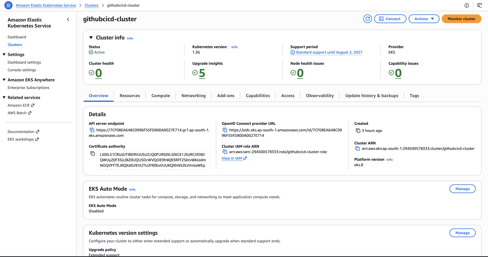
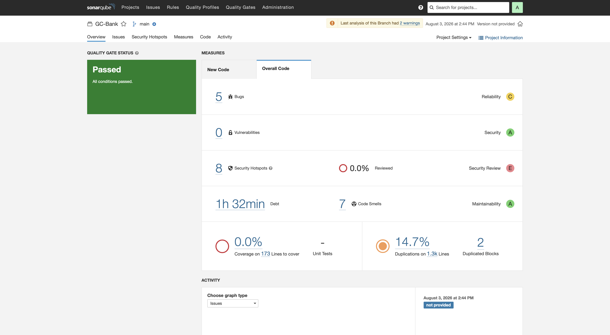

# BankApp — End-to-End DevSecOps Pipeline on AWS EKS

A Spring Boot banking web application shipped through a fully automated GitHub Actions
DevSecOps pipeline: build → security scan → test → SonarQube quality gate → Docker image →
deploy to an Amazon EKS cluster provisioned with Terraform.

[](https://github.com/hemanthdugga/github-actions-project/actions/workflows/cicd.yml)


---

## Table of Contents

- [Overview](#overview)
- [Application Features](#application-features)
- [Tech Stack](#tech-stack)
- [Architecture](#architecture)
- [Project Structure](#project-structure)
- [CI/CD Pipeline](#cicd-pipeline)
- [Required Secrets & Variables](#required-secrets--variables)
- [Getting Started (Local)](#getting-started-local)
- [Running with Docker](#running-with-docker)
- [Infrastructure Provisioning (Terraform + EKS)](#infrastructure-provisioning-terraform--eks)
- [Kubernetes Deployment](#kubernetes-deployment)
- [Kubernetes RBAC Setup](#kubernetes-rbac-setup)
- [Configuration Reference](#configuration-reference)
- [Testing & Code Coverage](#testing--code-coverage)
- [Security Notes](#security-notes)
- [Roadmap](#roadmap)

---

## Overview

This repository demonstrates a complete DevSecOps workflow around a real, working
application. The application (`bankapp`) is a
server-rendered Spring Boot banking portal backed by MySQL. Everything around it —
compilation, vulnerability scanning, secret scanning, unit tests, static analysis,
containerization, and cluster deployment — is automated in a single GitHub Actions
workflow that runs on every push to `main`.

**What this project shows:**

| Capability | Implementation |
| --- | --- |
| Application development | Spring Boot 3 + Spring Security + JPA + Thymeleaf |
| Filesystem/dependency scanning | Trivy |
| Secret scanning | Gitleaks |
| Static analysis + quality gate | SonarQube |
| Artifact management | GitHub Actions artifacts |
| Containerization | Docker Buildx (multi-platform ready) + Docker Hub |
| Infrastructure as Code | Terraform (VPC, subnets, IGW, SGs, IAM, EKS, node group) |
| Orchestration | Kubernetes manifests deployed to Amazon EKS |
| Access control | Kubernetes ServiceAccount + Role/RoleBinding + ClusterRole |

---

## Application Features

The banking portal supports the full retail-account lifecycle:

- **Registration** — create an account with a BCrypt-hashed password; opening balance `0`.
- **Login / Logout** — Spring Security form login, session invalidation on logout.
- **Dashboard** — current balance and account details for the authenticated user.
- **Deposit** — credit the account and record a `Deposit` transaction.
- **Withdraw** — debit the account with an insufficient-funds guard.
- **Transfer** — move money to another user by username; writes paired
  `Transfer Out` / `Transfer In` transaction records.
- **Transaction history** — chronological ledger for the logged-in account.

All routes except `/register` require authentication.

### Route Map

| Method | Path | Purpose |
| --- | --- | --- |
| `GET` | `/register` | Registration form (public) |
| `POST` | `/register` | Create account |
| `GET` | `/login` | Login page |
| `POST` | `/login` | Authenticate (Spring Security) |
| `GET` | `/dashboard` | Balance + account overview |
| `POST` | `/deposit` | Deposit funds |
| `POST` | `/withdraw` | Withdraw funds |
| `POST` | `/transfer` | Transfer to another username |
| `GET` | `/transactions` | Transaction history |
| `GET` | `/logout` | End session |

---

## Tech Stack

**Application**
- Java 17, Spring Boot 3.3.3
- Spring Web MVC, Spring Security 6, Spring Data JPA / Hibernate
- Thymeleaf + `thymeleaf-extras-springsecurity6`
- MySQL 8 (`mysql-connector-java` 8.0.33)
- JUnit 5, `spring-security-test`

**Platform & Tooling**
- GitHub Actions (self-hosted runner)
- Trivy, Gitleaks, SonarQube
- Docker + Buildx + QEMU, Docker Hub
- Terraform, AWS EKS, AWS CLI, kubectl
- Maven Wrapper (`./mvnw`)
---

## Architecture

```
                    ┌────────────────────────────────────────────┐
   git push main    │           GitHub Actions (self-hosted)     │
  ────────────────► │                                            │
                    │  compile ─► security-check ─► test ─►      │
                    │  build + SonarQube gate ─► docker push ─►  │
                    │  deploy to EKS                             │
                    └──────────────--------┬────────────-────────┘
                                           │ kubectl apply -f ds.yml
                                           ▼
             ┌───────────────────── AWS (ap-south-1) ─────────────────────┐
             │  VPC 10.0.0.0/16 · 2 public subnets (1a / 1b) · IGW        │
             │                                                            │
             │   EKS cluster: github-cicd-cluster                         │
             │   Node group: 3 × t2.medium                                │
             │                                                            │
             │   ┌──────────────────┐        ┌────────────────────────┐   │
             │   │ Service          │        │ Deployment: bankapp    │   │
             │   │ bankapp-service  │───────►│ duggahemanth/bankapp   │   │
             │   │ LoadBalancer     │        │ container :8080        │   │
             │   │ 80 → 8080        │        └───────────┬────────────┘   │
             │   └──────────────────┘                    │ JDBC           │
             │                                            ▼               │
             │                        ┌────────────────────────────────┐  │
             │                        │ Service: mysql-service :3306   │  │
             │                        │ Deployment: mysql:8 (bankappdb)│  │
             │                        └────────────────────────────────┘  │
             └────────────────────────────────────────────────────────────┘
```

### Application Layers

```
BankController      ── HTTP routes, pulls the principal from SecurityContextHolder
      │
AccountService      ── business rules (deposit/withdraw/transfer) + UserDetailsService
      │
AccountRepository   ── findByUsername
TransactionRepository ── findByAccountId
      │
Account ◄──1:N──► Transaction     (JPA entities; Account implements UserDetails)
      │
MySQL (bankappdb)  ── schema auto-managed via ddl-auto=update
```

---

## Project Structure

```
.
├── .github/workflows/cicd.yml       # 6-stage DevSecOps pipeline
├── EKS-Terraform/
│   ├── main.tf                      # VPC, subnets, IGW, SGs, IAM, EKS, node group
│   ├── variables.tf                 # ssh_key_name
│   └── output.tf                    # cluster_id, node_group_id, vpc_id, subnet_ids
├── src/main/java/com/example/bankapp/
│   ├── BankappApplication.java
│   ├── config/SecurityConfig.java
│   ├── controller/BankController.java
│   ├── model/{Account,Transaction}.java
│   ├── repository/{Account,Transaction}Repository.java
│   └── service/AccountService.java
├── src/main/resources/
│   ├── application.properties
│   ├── templates/{login,register,dashboard,transactions}.html
│   └── static/mysql/SQLScript.txt   # CREATE DATABASE bankappdb;
├── src/test/java/com/example/bankapp/BankappApplicationTests.java
├── ds.yml                           # MySQL + bankapp Deployments and Services
├── Dockerfile                       # eclipse-temurin:17-jdk-alpine runtime image
├── Setup-RBAC.md                    # ServiceAccount / Role / RoleBinding / token
├── sonar-project.properties         # projectKey = GC-Bank
└── pom.xml
```

---

## CI/CD Pipeline

Defined in [.github/workflows/cicd.yml](.github/workflows/cicd.yml). Triggered on
`push` to `main`; every job runs on a **self-hosted** runner and each job depends on the
previous one, so the pipeline fails fast.

| # | Job | What it does |
| --- | --- | --- |
| 1 | `compile` | JDK 17 (Temurin) with Maven cache → `mvn compile` |
| 2 | `security-check` | Installs Trivy → `trivy fs` filesystem scan; installs Gitleaks → secret scan of the repo |
| 3 | `test` | `mvn test` (JUnit 5) |
| 4 | `build_project_and_sonar_scan` | `mvn package`, uploads `target/*.jar` as the `app-jar` artifact, full-depth checkout, SonarQube scan |
| 5 | `buils_docker_image_and_push` | Downloads `app-jar` into `./app`, logs in to Docker Hub, sets up QEMU + Buildx, builds and pushes `duggahemanth/bankapp:latest` |
| 6 | `deploy_to_kubernetes` | Installs AWS CLI, configures AWS credentials (`ap-south-1`), installs `kubectl`, writes the kubeconfig from a secret, `kubectl apply -f ds.yml` |

```
compile → security-check → test → build+sonar → docker build/push → deploy to EKS
```

> The `Dockerfile` copies `app/*.jar`, which is exactly where job 5 downloads the
> artifact. If you build the image locally, place the JAR in `./app/` first.

### Self-Hosted Runner Requirements

The pipeline assumes an Ubuntu/Debian self-hosted runner with:

- `sudo` without a password prompt (Trivy/Gitleaks/AWS CLI installs use `apt` and `sudo ./aws/install`)
- Docker daemon available to the runner user
- `curl`, `wget`, `gnupg`, `unzip`
- Outbound network access to Docker Hub, SonarQube, and the AWS EKS endpoint

---

## Required Secrets & Variables

Configure these under **Settings → Secrets and variables → Actions**.

### Secrets

| Name | Used by | Description |
| --- | --- | --- |
| `SONAR_TOKEN` | Sonar scan + quality gate | SonarQube user token |
| `DOCKERHUB_TOKEN` | Docker login | Docker Hub access token |
| `AWS_ACCESS_KEY_ID` | AWS credentials | IAM key with EKS access |
| `AWS_SECRET_ACCESS_KEY` | AWS credentials | IAM secret |
| `EKS_KUBECONFIG` | Deploy job | Full kubeconfig for the target cluster |

### Variables

| Name | Description |
| --- | --- |
| `SONAR_HOST_URL` | SonarQube server URL (e.g. `http://<host>:9000`) |
| `DOCKERHUB_USERNAME` | Docker Hub username |

---

## Getting Started (Local)

### Prerequisites

- JDK 17
- MySQL 8 running on `localhost:3306`
- Maven Wrapper (bundled — no separate Maven install needed)

### 1. Create the database

```bash
mysql -u root -p -e "CREATE DATABASE bankappdb;"
```

### 2. Point the app at your database

Edit [src/main/resources/application.properties](src/main/resources/application.properties),
or override at runtime so credentials never live in the repo:

```bash
SPRING_DATASOURCE_URL="jdbc:mysql://localhost:3306/bankappdb?useSSL=false&serverTimezone=UTC" \
SPRING_DATASOURCE_USERNAME=root \
SPRING_DATASOURCE_PASSWORD='<your-password>' \
./mvnw spring-boot:run
```

Hibernate creates the `account` and `transaction` tables automatically
(`spring.jpa.hibernate.ddl-auto=update`).

### 3. Open the app

```
http://localhost:8080/register
```

Register a user, log in, and the dashboard is available at `/dashboard`.

### Build a JAR

```bash
./mvnw clean package
```

The artifact lands in `target/bankapp-0.0.1-SNAPSHOT.jar`.

---

## Running with Docker

The image expects a pre-built JAR in `./app/`:

```bash
./mvnw clean package && mkdir -p app && cp target/*.jar app/
```

```bash
docker build -t duggahemanth/bankapp:latest .
```

```bash
docker run -p 8080:8080 \
  -e SPRING_DATASOURCE_URL="jdbc:mysql://host.docker.internal:3306/bankappdb?useSSL=false&serverTimezone=UTC&allowPublicKeyRetrieval=true" \
  -e SPRING_DATASOURCE_USERNAME=root \
  -e SPRING_DATASOURCE_PASSWORD='<your-password>' \
  duggahemanth/bankapp:latest
```

---

## Infrastructure Provisioning (Terraform + EKS)



[EKS-Terraform/](EKS-Terraform/) provisions everything the deployment needs in
`ap-south-1`:

- VPC `10.0.0.0/16` with two public subnets across `ap-south-1a` / `ap-south-1b`
- Internet Gateway, route table, and subnet associations
- Security groups for the cluster control plane and worker nodes
- IAM roles for the cluster (`AmazonEKSClusterPolicy`) and nodes
  (`AmazonEKSWorkerNodePolicy`, `AmazonEKS_CNI_Policy`, `AmazonEC2ContainerRegistryReadOnly`)
- EKS cluster `github-cicd-cluster`
- Managed node group: 3 × `t2.medium` (min = max = desired = 3), SSH access via the
  `ssh_key_name` variable (default `GitHub-CICD`)

```bash
cd EKS-Terraform
terraform init
terraform plan -var="ssh_key_name=<your-ec2-keypair>"
terraform apply -var="ssh_key_name=<your-ec2-keypair>"
```

Then point `kubectl` at the new cluster:

```bash
aws eks update-kubeconfig --region ap-south-1 --name github-cicd-cluster
```

Tear down when finished:

```bash
cd EKS-Terraform && terraform destroy
```

> Terraform state is local by default. For team use, move it to an S3 backend with
> DynamoDB locking.

---

## Kubernetes Deployment



[ds.yml](ds.yml) defines four objects:

| Object | Kind | Notes |
| --- | --- | --- |
| `mysql` | Deployment | `mysql:8`, `Recreate` strategy, database `bankappdb` |
| `mysql-service` | Service | ClusterIP on `3306` |
| `bankapp` | Deployment | 1 replica of `duggahemanth/bankapp:latest`, port `8080` |
| `bankapp-service` | Service | `LoadBalancer`, `80 → 8080` |

The app container reaches MySQL over the in-cluster DNS name `mysql-service:3306`.

```bash
kubectl apply -f ds.yml
```

```bash
kubectl get pods,svc -w
```

Fetch the public endpoint once the load balancer is provisioned:

```bash
kubectl get svc bankapp-service -o jsonpath='{.status.loadBalancer.ingress[0].hostname}'
```

> The MySQL Deployment has no PersistentVolumeClaim — pod restarts lose data. See
> [Roadmap](#roadmap).

---

## Kubernetes RBAC Setup

[Setup-RBAC.md](Setup-RBAC.md) walks through creating a least-privilege deployer identity
in the `webapps` namespace:

1. A `ServiceAccount` for the pipeline
2. A namespaced `Role` covering pods, deployments, services, configmaps, secrets, jobs,
   HPAs, and related resources
3. A `RoleBinding` tying the role to the service account
4. A `ClusterRole` + `ClusterRoleBinding` for cluster-scoped `persistentvolumes`
5. A long-lived service-account token to embed in the pipeline's kubeconfig

Apply the manifests from that document, then generate the token and use it to build the
kubeconfig stored in the `EKS_KUBECONFIG` secret.

---

## Configuration Reference

| Property / Env var | Default | Purpose |
| --- | --- | --- |
| `SPRING_DATASOURCE_URL` | `jdbc:mysql://localhost:3306/bankappdb?useSSL=false&serverTimezone=UTC` | JDBC connection string |
| `SPRING_DATASOURCE_USERNAME` | `root` | DB user |
| `SPRING_DATASOURCE_PASSWORD` | *(set in properties)* | DB password |
| `spring.jpa.hibernate.ddl-auto` | `update` | Schema evolution on startup |
| `spring.jpa.show-sql` | `true` | Log generated SQL |
| Server port | `8080` | Exposed by the Dockerfile |
| `sonar.projectKey` / `sonar.projectName` | `GC-Bank` | SonarQube project identity |

Nexus release/snapshot repositories are declared under `distributionManagement` in
[pom.xml](pom.xml) for `mvn deploy`.

---

## Testing & Code Coverage



```bash
./mvnw test
```

JaCoCo is bound to the `test` phase, so a coverage report is produced automatically:

```
target/site/jacoco/index.html
```

The current test suite ([BankappApplicationTests.java](src/test/java/com/example/bankapp/BankappApplicationTests.java))
contains two placeholder assertions and does **not** yet cover the service or controller
layers — real coverage is the highest-value next step (see [Roadmap](#roadmap)).

---

## Security Notes

The pipeline runs Trivy and Gitleaks on every push, and SonarQube gates the build. A few
findings in the current code are worth calling out explicitly:

- **Hardcoded credentials in version control.** `Test@123` appears in
  [application.properties](src/main/resources/application.properties) and in
  [ds.yml](ds.yml) (both the MySQL root password and the app's datasource password).
  Move these to a Kubernetes `Secret` and to environment-injected values; expect Gitleaks
  to flag them.
- **CSRF protection disabled** in [SecurityConfig.java](src/main/java/com/example/bankapp/config/SecurityConfig.java) —
  a form-based app performing money transfers should re-enable it and add CSRF tokens to
  the Thymeleaf forms.
- **Nexus and SonarQube endpoints are plain HTTP** over public IPs in
  [pom.xml](pom.xml) — use HTTPS and private networking.
- **Overly broad security groups** in [main.tf](EKS-Terraform/main.tf) — the node group
  allows all ingress from `0.0.0.0/0`. Restrict to the control-plane SG and known CIDRs.
- **No transactional boundary** on transfers in `AccountService.transferAmount` — add
  `@Transactional` so a failure mid-transfer cannot debit without crediting.
- **No server-side amount validation** — negative or zero deposits/withdrawals are
  currently accepted.

---


